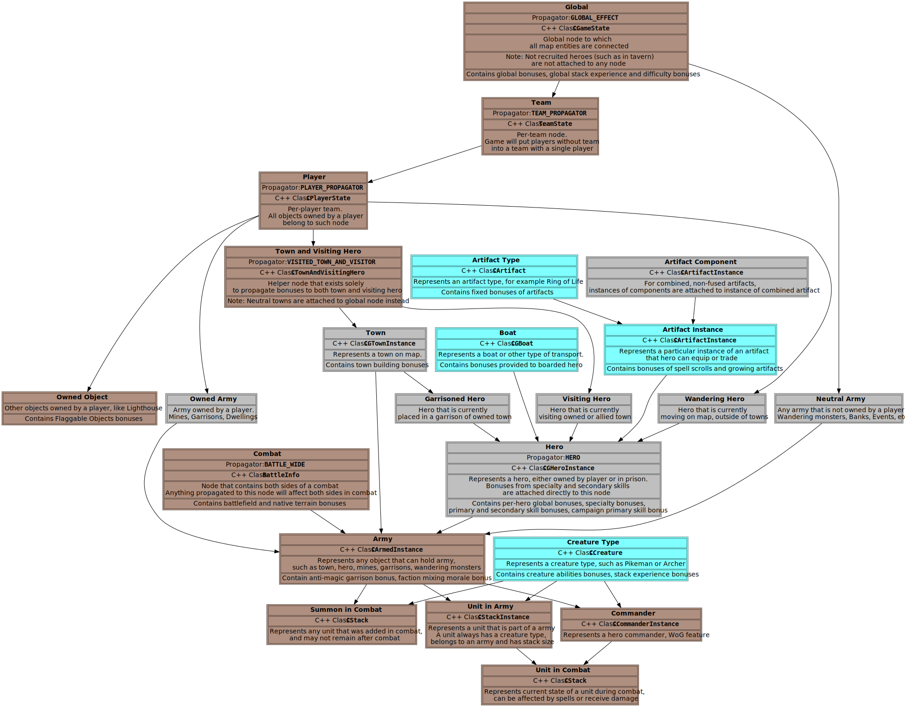

# Bonus System

The bonus system of VCMI is a set of mechanisms that make handling of different bonuses for heroes, towns, players and units easier. The system consists of a set of nodes representing objects that can be a source or a subject of a bonus and two directed acyclic graphs (DAGs) representing inheritance and propagation of bonuses. Core of bonus system is defined in HeroBonus.h file.

## Bonus System Nodes



Legend:
- brown: actual nodes, and members of bonus system graph
- cyan: constant nodes that act only as source, and can not receive bonuses
- gray: virtual nodes to clarify graph layout. Actual node is located below. For example, there is no entity for "Visiting Hero", instead visiting hero is hero that is attached to player node only via Town node.


## Propagation and inheritance

Each bonus originates from some node in the bonus system, and may have propagator and limiter objects attached to it. Bonuses are shared around as follows:

1. Bonuses with propagator are propagated to "matching" descendants in the red DAG - which descendants match is determined by the propagator. Bonuses without a propagator will not be propagated.
2. Bonuses without limiters are inherited by all descendants in the black DAG. If limiters are present, they can restrict inheritance to certain nodes.

Inheritance is the default means of sharing bonuses. A typical example is an artefact granting a bonus to attack/defense stat, which is inherited by the hero wearing it, and then by creatures in the hero's army.
A common limiter is by creature - e.g. the hero Eric has a specialty that grants bonuses to attack, defense and speed, but only to griffins.
Propagation is used when bonuses need to be shared in a different direction than the black DAG for inheritance. E.g. Magi and Archmagi on the battlefield reduce the cost of spells for the controlling hero.

### Technical Details

- Propagation is done by copying bonuses to the target nodes. This happens when bonuses are added.
- Inheritance is done on-the-fly when needed, by traversing the black DAG. Results are cached to improve performance.
- Whenever a node changes (e.g. bonus added), a global counter gets increased which is used to check whether cached results are still current.

## Operations on the graph

There are two basic types of operations that can be performed on the graph:

### Adding a new node

When node is attached to a new black parent (the only possibility - adding parent is the same as adding a child to it), the propagation system is triggered and works as follows:

- For the attached node and its all red ancestors
- For every bonus
- Call propagator giving the new descendant - then attach appropriately bonuses to the red descendant of attached node (or the node itself).

E.g. when a hero equips an artifact, the hero gets attached to the artifact to inherit its bonuses.

### Deleting an existing node

Analogically to the adding a new node, just remove propagated bonuses instead of adding them. Then update the hierarchy.

E.g. when a hero removes an artifact, the hero (which became a child of the artifact when equipping it) is removed from it.

Note that only *propagated* bonuses need to be handled when nodes are added or removed. *Inheritance* is done on-the-fly and thus automatic.

## Limiters

If multiple limiters are specified for a bonus, a child inherits the bonus only if all limiters say that it should.

So e.g. a list of multiple creature type limiters (with different creatures) would ensure that no creature inherits the bonus. In such a case, the solution is to use one bonus per creature.

## Propagators

## Updaters

Updaters are objects attached to bonuses. They can modify a bonus (typically by changing *val*) during inheritance, including bonuses that a node "inherits" from itself, based on properties (typically level) of the node it passes through. Which nodes update a bonus depends on the type of updater. E.g. updaters that perform updates based on hero level will update bonuses as the are inherited by heroes.

The following example shows an artifact providing a bonus based on the level of the hero that wears it:

```json
   "core:greaterGnollsFlail":
   {
       "text" : { "description" : "This mighty flail increases the attack of all gnolls under the hero's command by twice the hero's level." },
       "bonuses" : [
           {
               "limiters" : [
                   {
                       "parameters" : [ "gnoll", true ],
                       "type" : "CREATURE_TYPE_LIMITER"
                   }
               ],
               "subtype" : "primSkill.attack",
               "type" : "PRIMARY_SKILL",
               "val" : 2,
               "updater" : "TIMES_HERO_LEVEL"
           }
       ]
   }
```
